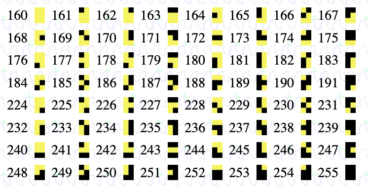

# BBCTaipan

A BBC BASIC port of the classic Apple II game, Taipan...

The Applesoft BASIC code from the book,  [TAIPAN - A historical adventure for the Apple Computer (PDF)][1] by *Art Canfil*, *Karl Albrecht*, and *Jim McClenahan*, linked to from [taipangame.com][2].

## Caveats

 - This code is still a WIP, not finished.
 - Multiple versions of line numbers may exist, with the latter line being the preferred version (to date)...
 - The code can be pasted into emulators such as BeebEm5. Any duplicate line numbers get resolved by the last version of the duplicate line numbers being accepted as the final verison.
 - There may be graphic corruption with the animations (of battles)
 - I have not figured out how to create *inverse text*, so the "look" differs slightly from that of the AppleSoft BASIC version

The code runs and is playable though.

## Known issues

 - A lack of inverse characters, resulting in a lack of table delimiting decorations.

## TODO

 - Add offset (constant) variables:
   - x - For non graphics characters (at the start of the line) lines without graphics control characters, *at the start* of the line.
   - y - For centralising the screen(?). We have more lines on the BBC (25)  vs Apple II (24)

## Notes

This is a barebones version of Taipan, with no graphics or flashiness whatsoever, to speak of. The reasons (excuses?) why are given in the lengthly notes, [BBCBASIC_BlockGraphicsDemo](xtras/mode_7_adventures/BBCBASIC_BlockGraphicsDemo.md).

### Two files

The file name: The are two files: a clean version (`BBCTAIPAN.BAS`), and a personal notes version (`TAIPAN_BAS_BBC_NORMAL=0_TABBED_OCRfixed.txt`). Both versions work fine when pasted into an emulator, such as BeebEm5. However, if typing it in manaually then the clean version, is the file to use. There are also, *now*, a couple of auto-bootable disk images ([`TAIPAN_80.SSD` and `TAIPAN_40.SSD`](disks/) – referring to the number of tracks, not columns), along with my personal notes in getting a disk to format, save, load and auto-boot, [BBCUsingFloppies](xtras/floppy_disk_adventures/BBCUsingFloppies.md).

The unsantised version (`TAIPAN_BAS_BBC_NORMAL=0_TABBED_OCRfixed.txt`) contains personal notes and duplicate lines, where minor changes have been necessary and various attempts tried. The *last* occurence of any duplicate line(s) will be the final "working" version of the line. It might not be the next successive line either – it *might* be in a repeated *group of lines* further doen the source code. This format works perfectly when entering (i.e. pasting) the code into an emulator (such as BeebEm) as only the *last entered version* of the line is accepted – much like when one types code in manually.

### The file name

THe history of the weird filename, if you must know, is that back in the winter of 2023 the initial port was `TAIPAN_BAS_BBC_NORMAL=0.txt`, where (apart from obvious bugs) only the `NORMAL`, `INVERSE` and `FLASH` commands of the Apple II had been converted into variables, as markers. The next main "stage" was changing the `VTAB` and `HTAB` of the Apple II to the BBC `TAB` command/keyword, `TAIPAN_BAS_BBC_NORMAL=0_TABBED.txt`. That (along with a host of other fixes to get it to run and play) was how it was left in 2023. Then in mid 2025, whilst dong the MMBASIC and X16 ports, I came across a number of other OCR type bugs, in the original Apple II code, that had *somehow* "perculated through" to all of the other ports, which resulted in `TAIPAN_BAS_BBC_NORMAL=0_TABBED_OCRfixed.txt`.

#### `CHR$(133)` - A hangover from the Tandy version

There is a carry-over of a bug in the source code for the Apple II from the book for the Apple II, and that is the missing half vertical bar character (`CHR$(133)`), which the Apple II does not have, but the BBC *does*, so it can be reinstated. (The Apple II dosn't have block *sixel* characters and the BBC doesn't have `INVERSE` – you can't win!)

Line 150 (page 42) is given as 
```
150 FOR I = 0 TO 5: VTAB 5 + I:PRINT G$(I):VTAB 5 + I:HTAB 11:PRINT CHR$ (133);: Q=SG(I):GOSUB 1330:VTAB 5 + I:HTAB 26:PRINT CHR$ (133);: Q = GG(I):GOSUB 1330: NEXT I: INVERSE: PRINT A$: NORMAL: RETURN
```
However, `CHR$(133) is only a valid symbol on the TRS-80 (vertical bar). The `CHR$(133)` can be removed from the Applesoft version, as that character code prints nothing useful:
```
150 FOR I = 0 TO 5: VTAB 5 + I:PRINT G$(I):VTAB 5 + I:HTAB 11: Q=SG(I):GOSUB 1330:VTAB 5 + I:HTAB 26: Q = GG(I):GOSUB 1330: NEXT I: INVERSE: PRINT A$: NORMAL: RETURN
```
Or you could replace `CHR$(133)` with `CHR$(124)`, which is a thin vertical bar.

For more information, see [Looking for an accurate Apple II(e) character set - in particular, what is CHR$(133)?][5]

From [this answer](https://retrocomputing.stackexchange.com/a/28132/202) to [Looking for an accurate Apple II\(e\) character set - in particular, what is CHR\$\(133\)?](https://retrocomputing.stackexchange.com/q/28127/202), the accurate character would be the left vertical half bar `CHR$(181)`, not the right vertical half bar `CHR$(234)`. The graphics *sixels* characters can be seen [here](https://www.bbcbasic.co.uk/bbcwin/manual/bbcwinh.html):

[

## See also

 - [Taipan for BBC BASIC](https://gr33nonline.wordpress.com/2023/12/12/taipan-for-bbc-basic/)

## Related

 - [!!!NOT!!! TRS80Taipan](https://github.com/greenonline/TRS80Taipan)
 - [MMBASICTaipan](https://github.com/greenonline/MMBASICTaipan)
 - [MacTaipan](https://github.com/greenonline/MacTaipan)
 - [Taipan_40_Column_Apple_II](https://github.com/greenonline/Taipan_40_Column_Apple_II)
 - [CommanderX16Taipan](https://github.com/greenonline/CommanderX16Taipan)

  [1]: https://taipangame.com/pdf/TaipanAHistoricalAdventureForTheAppleComputerAppleIIEdition.pdf
  [2]: https://taipangame.com/
